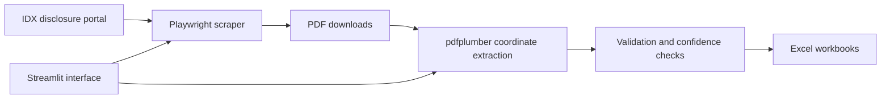

# IDX Ownership Data Pipeline

[](https://www.python.org/)
[](https://playwright.dev/python/)
[](https://streamlit.io/)
[](https://github.com/INo-xious/idx-ownership-data-pipeline/actions/workflows/ci.yml)

A Python pipeline that discovers Indonesian Stock Exchange disclosure PDFs, extracts 5%+ ownership tables, and produces analysis-ready Excel workbooks.

> This is an independent educational project. It is not affiliated with or endorsed by IDX, BEI, or KSEI.

## Why This Project Exists

Ownership disclosures are published as PDFs whose tables are difficult to analyze directly. This project turns that manual workflow into a reproducible pipeline:

1. Search the IDX disclosure portal for a keyword.
2. Download matching PDF attachments.
3. Reconstruct multi-column ownership tables using PDF word coordinates.
4. Validate key numeric fields and attach parsing-confidence signals.
5. Export per-document and combined Excel workbooks.



## Features

- Browser automation for JavaScript-rendered disclosure pages
- Authenticated PDF downloads using cookies transferred from Playwright
- Filename sanitization and PDF-header validation
- Position-aware extraction for irregular, multi-column PDF tables
- Recovery for wrapped addresses and spaced-out PDF glyphs
- Parsing warnings and confidence scores for review
- Batch processing with optional merged Excel output
- Streamlit interface plus command-line workflows

## Quick Start

### Requirements

- Python 3.10 or newer
- Internet access for the disclosure search and downloads

### Installation

```bash
git clone https://github.com/INo-xious/idx-ownership-data-pipeline.git
cd idx-ownership-data-pipeline

python -m venv .venv
source .venv/bin/activate  # Windows: .venv\Scripts\activate

python -m pip install --upgrade pip
python -m pip install -r requirements.txt
python -m playwright install chromium
```

### Run the Interface

```bash
streamlit run run_gui.py
```

The interface runs the complete workflow and provides the final workbook as a download.

## Command-Line Usage

Download matching PDFs:

```bash
python scrape_and_download.py \
  --keyword "5%" \
  --out-pdf-dir outputs/pdfs
```

Download and extract in one run:

```bash
python scrape_and_download.py \
  --keyword "5%" \
  --extract \
  --extract-out-dir outputs/extracted
```

Extract a local PDF directly:

```bash
python extract_ownership_table.py \
  --pdf path/to/disclosure.pdf \
  --out outputs/extracted/ownership_table.xlsx
```

Useful extraction options:

```text
--max-pages N          Process at most N pages from the selected start page
--page-from N          Start at a specific 1-based PDF page
--page-to N            Stop at a specific 1-based PDF page
--debug-dir PATH       Write per-page word-coordinate CSV files
--include-raw-debug    Include clustered raw rows in the workbook
```

## Output

```text
outputs/
├── pdfs/                       # Downloaded disclosure documents
└── extracted/
    ├── *.ownership_table.xlsx  # Per-document results
    └── ownership_table.xlsx    # Optional combined workbook
```

The main sheet includes the source document and page, security ticker, shareholder details, before/after holdings, percentages, parsing warnings, and a confidence value. Generated documents and workbooks are intentionally excluded from Git.

## Project Structure

| Path | Responsibility |
| --- | --- |
| `scrape_and_download.py` | Search, pagination, cookie transfer, and PDF downloads |
| `extract_ownership_table.py` | Coordinate-based table reconstruction and validation |
| `run_gui.py` | Streamlit orchestration, progress reporting, merging, and downloads |
| `tests/` | Unit tests for filename, PDF, numeric, and row-parsing behavior |
| `.github/workflows/ci.yml` | Automated syntax and unit-test checks |

## Development

```bash
python -m pip install -r requirements.txt -r requirements-dev.txt
python -m compileall -q .
python -m pytest
```

Please use sample documents that you are allowed to process. Do not commit downloaded disclosures, extracted personal information, or generated workbooks.

## Limitations

- IDX page structure and selectors can change without notice.
- The extractor is tuned for a specific ownership-table family and may require adjustment for new layouts.
- Confidence values are review aids, not statistical guarantees.
- Extracted results should be checked against the source PDF before research or financial use.

## Roadmap

- Add anonymized fixtures for end-to-end extraction tests
- Add resume-safe screenshots and a short demonstration
- Separate layout profiles for additional disclosure formats
- Add structured CSV and database export options

## License

Released under the [MIT License](LICENSE).
